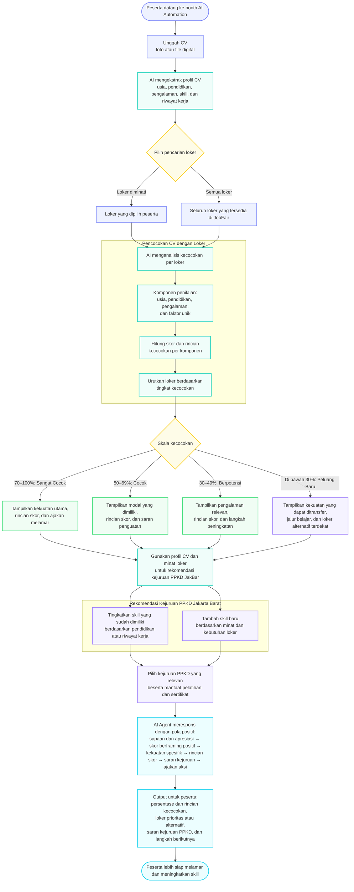

# MatchingLoker

**Pencocokan CV dengan Lowongan Kerja & Rekomendasi Kejuruan PPKD Jakarta Barat**

Proyek automation workflow yang dirancang untuk digunakan di JobFair, sebagai karya PPKD Jakarta Barat.

---

## Latar Belakang Masalah

- Peserta pencari kerja di JobFair sering bingung menentukan pilihan dari banyaknya loker yang tersedia, terutama dalam menilai kecocokan loker dengan latar belakang yang mereka miliki.
- PPKD Jakarta Barat memiliki kejuruan **AI Automation Engineer** dan berbagai kejuruan berkualitas lainnya, yang didampingi instruktur terbaik dan disiapkan untuk memenuhi kebutuhan industri. Kejuruan-kejuruan ini adalah fasilitas untuk menaikkan nilai jual masyarakat di dunia kerja melalui pendidikan dan pelatihan, khususnya masyarakat wilayah DKI Jakarta.
- PPKD perlu semakin dikenal oleh masyarakat, terutama peserta JobFair, agar jangkauan manfaatnya semakin luas sesuai dengan cita-cita luhur PPKD.

## Ide Utama

**MatchingLoker** adalah otomatisasi yang mencocokkan CV peserta JobFair dengan loker yang tersedia. Harapannya, peserta lebih mudah memilih, mempertimbangkan, dan memahami loker yang ada, sekaligus menghemat waktu.

Selain memberikan insight kecocokan loker, MatchingLoker juga menawarkan kecocokan dengan kejuruan PPKD Jakarta Barat bagi peserta yang ingin:

- meningkatkan kemampuan yang sudah dikuasai,
- memperkuat CV melalui pendidikan, pelatihan, dan sertifikat,
- menambah skill baru.

Ketiganya bertujuan memperbesar peluang peserta mendapatkan pekerjaan.

## Cara Kerja

### 1. Upload CV dan pilih loker
- Peserta mengunggah CV dalam bentuk foto atau file digital.
- Peserta memilih loker yang diminati, atau memilih semua loker yang tersedia di JobFair.

### 2. Pencocokan CV dengan loker
CV peserta dicocokkan dengan loker yang dipilih (atau seluruh loker yang tersedia) berdasarkan 4 komponen:

1. Kecocokan usia
2. Kecocokan latar belakang pendidikan
3. Kecocokan pengalaman
4. Faktor unik *(masih terbuka untuk didiskusikan)*

Dari proses ini diperoleh tingkat kecocokan CV peserta terhadap setiap loker.

### 3. Rekomendasi kejuruan PPKD Jakarta Barat
Karena profil peserta sudah dikenali dari CV-nya, sistem menawarkan kejuruan PPKD melalui dua jalur:

- **Meningkatkan skill yang sudah dimiliki.** Rekomendasi didasarkan pada latar belakang pendidikan atau riwayat pekerjaan, untuk menaikkan level kemampuan peserta.
- **Menambah skill baru.** Rekomendasi berangkat dari ketertarikan peserta pada loker tertentu, dengan kejuruan PPKD yang cocok atau mendekati cocok.

## Karakter AI Agent

AI Agent harus **ramah** dan, yang terpenting, **encouraging**. Meskipun persentase kecocokan rendah (misalnya di bawah 30%), AI Agent tidak boleh memberikan jawaban yang mengarah pada discouraging.

Skala kecocokan *(standar pastinya belum ditentukan)*:

| Skor | Label |
|---|---|
| 70-100% | Sangat Cocok |
| 50-69% | Cocok |
| 30-49% | Berpotensi |
| Di bawah 30% | Peluang Baru |

## Alur Workflow

## Output yang Diharapkan

1. Persentase kecocokan CV dengan loker
2. Saran kejuruan PPKD

## Masukan singkat untuk flowchart:

- Tidak ada langkah kegagalan. Belum ada cabang untuk foto CV yang buram atau tidak terbaca (minta unggah ulang).
- Tidak ada persetujuan data. Belum ada langkah consent sebelum CV diunggah, padahal ini data pribadi (UU PDP).
- Skala dinilai sekali. Kalau peserta memilih "Semua loker", skala kecocokan sebenarnya berlaku per loker, tapi di diagram terlihat hanya satu kali.
